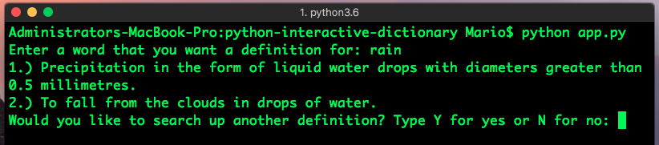
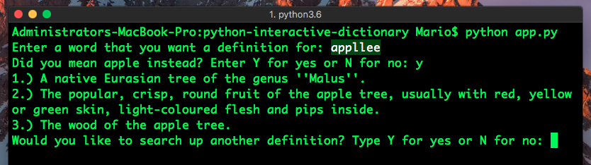
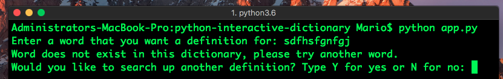
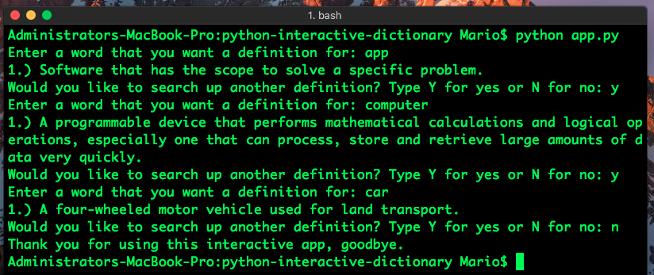

# Interactive Python Dictionary

### The purpose of this app is to be an interactive dictionary where a user will input a word and the app will find any definitions pertaining to that word. 

I am loading a `JSON ` file of words and their definitions as key/value pairs, this is the dictionary that I will be using as a reference in my app and can be found in the `Resources` folder. It uses python's `input()` function to ask the user to input a word that they want to know the definition for.

**Upon running `app.py`, the user is asked to input a word that they would like a definition for. If the word is spelled correctly and is found in our `JSON` word dictionary, then it will return that word's definition. If the word has more than one definition it will show the the definitions as a list.**


**If there is no such word in our dictionary but if it does have a similar spelling to a word that exists in our dictionary, then it will recommend a similar word. This is possible with the function ```get_close_matches(word, possibilities, n: int=3, cutoff: float=0.6)``` from the python library called `difflib`. This function will take in the user's word as the first argument, followed by the possibilities that it can compare the initial word with as the second argument (in this case the possibilities are all of the keys in our `JSON` dictionary `data.keys()`), followed by the amount of similar words that we want to get back (`n=3` is the default value), and the last argument is an index as a `float` from 0 to 1, where possible words that do not have an index of 0.6 or higher are ignored and not suggested to the user. An index of 0.6 or higher indicates that the similar words being suggested match more closely to the user's word.**



**If the user puts in a word that is not in the ditcionary and the function `get_close_matches()` cannot find a similar word then it will let the user know that that word does not exist in the dictionary and to please try again.**


**Lastly, I am using a `while` loop that will keep the app running as long as the user keeps typing in yes when being asked if they want to search for another definition.**


